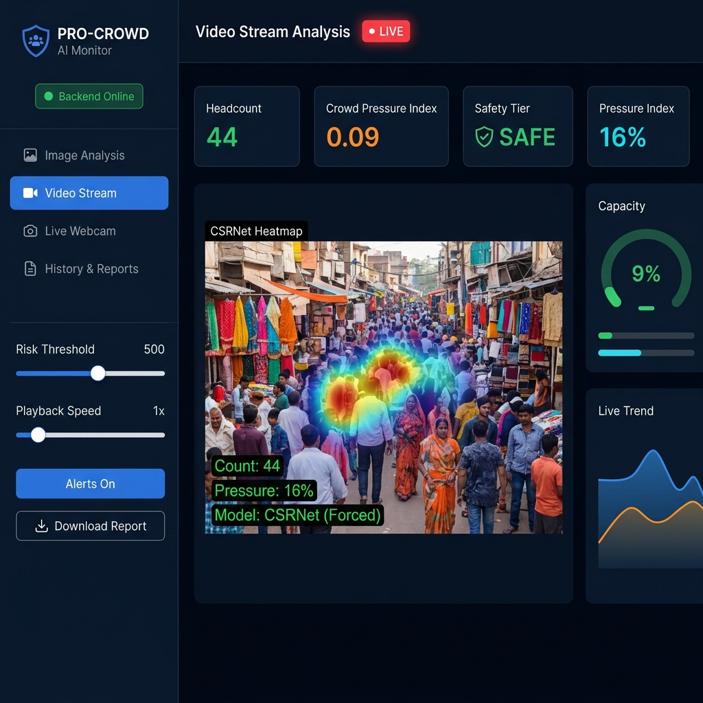

<div align="center">



# 🛡️ PRO-CROWD AI — Command Center

### Real-Time AI-Powered Crowd Density Analysis & Disaster Prevention Platform

[](https://python.org)
[](https://flask.palletsprojects.com)
[](https://react.dev)
[](https://vitejs.dev)
[](https://pytorch.org)
[](https://ultralytics.com)
[](LICENSE)

**[🔴 Live Demo: Command Center](https://pro-crowd-ai-command-center.vercel.app/)**

</div>

---

## 📖 Overview

**PRO-CROWD AI** is an advanced, real-time command center designed to monitor crowd density and prevent public safety disasters (such as stampedes or severe overcrowding). By analyzing live CCTV feeds or static images, the system provides instantaneous headcount estimations, dynamic heatmaps, and a calculated "Crowd Pressure Index" to help safety personnel take proactive measures.

The system utilizes a powerful hybrid AI approach:
- **Sparse Crowds:** Processed efficiently using **YOLOv8** for individual bounding-box detection.
- **Dense Crowds:** Automatically switches to **CSRNet (Congested Scene Recognition Network)**—a deep learning model based on VGG16—to generate highly accurate density maps when headcounts exceed safety thresholds.

---

## 🌟 Core Features

- **Hybrid AI Engine**: Seamless transition between YOLOv8 (for speed in sparse scenes) and CSRNet (for accuracy in extreme density).
- **Real-Time Video Streaming**: Backend processes video frames and streams them to the client via low-latency MJPEG over HTTP.
- **Dynamic Heatmaps**: Overlays real-time density heatmaps onto the video feed to identify high-pressure choke points.
- **Safety Assessment System**: Calculates a real-time "Pressure Index" (0-100%). Automatically issues actionable recommendations (e.g., *Safe*, *Elevated*, *Warning*, *Critical*).
- **Performance Analytics**: Generates downloadable PDF reports with session statistics.
- **Modern UI**: A dark-mode, glassmorphism dashboard built with React and Framer Motion for a premium command-center experience.

---

## 🏗️ Architecture & Tech Stack

### Frontend (User Interface)
Built for speed and reactivity. Communicates with the backend via REST APIs and streams processed video directly.
- **React.js (Vite)**
- **Tailwind CSS / Vanilla CSS** for custom aesthetics
- **Recharts** for real-time telemetry graphs
- **Lucide React** for modern iconography
- **Framer Motion** for micro-animations

### Backend (Inference Server)
Handles all heavy lifting, including PyTorch tensor manipulation and OpenCV image processing.
- **Python 3.12 / Flask**
- **PyTorch** (CSRNet architecture)
- **Ultralytics** (YOLOv8)
- **OpenCV** (Image transformations and MJPEG streaming)
- **SQLite** (Session and history logging)

---

## 🚀 Local Setup & Installation

### 1. Backend (Python/Flask)
The backend handles the AI processing and must be started first.

```bash
cd backend

# Create a virtual environment (recommended)
python -m venv venv
source venv/bin/activate  # On Windows: venv\Scripts\activate

# Install required dependencies
pip install -r requirements.txt

# Start the Flask server
python server.py
```
*Note: Ensure your `crowd.pth` (or `best_csrnet_shanghaiA.pth`) model weights are located in the `backend` or project root directory before starting the server. Wait for the "✅ Server active and model loaded." message.*

### 2. Frontend (React/Vite)
Open a new terminal window to start the frontend development server.

```bash
cd frontend

# Install Node.js dependencies
npm install

# Start the Vite server
npm run dev
```
*The dashboard will be available at `http://localhost:5173`.*

---

## 🌐 Deployment Details

This project is configured for cloud deployment:
- **Frontend**: Deployed on **Vercel** (`https://pro-crowd-ai-command-center.vercel.app/`). Configured using `VITE_API_URL` to route requests dynamically to the backend.
- **Backend**: Configured to be hosted on platforms like **Render**, **Railway**, or **AWS EC2**. The `requirements.txt` utilizes `opencv-python-headless` and `gunicorn` to ensure compatibility with Linux server environments. (Minimum 2GB RAM instance required for PyTorch models).

---

## 📄 License
This project is licensed under the MIT License.
